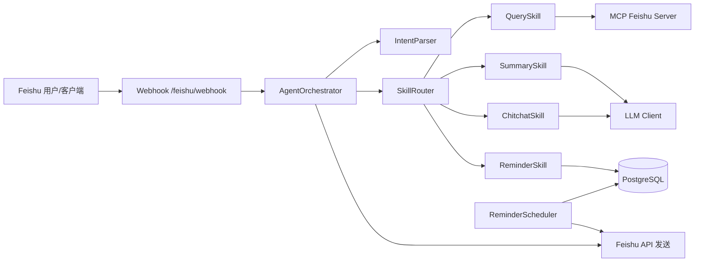
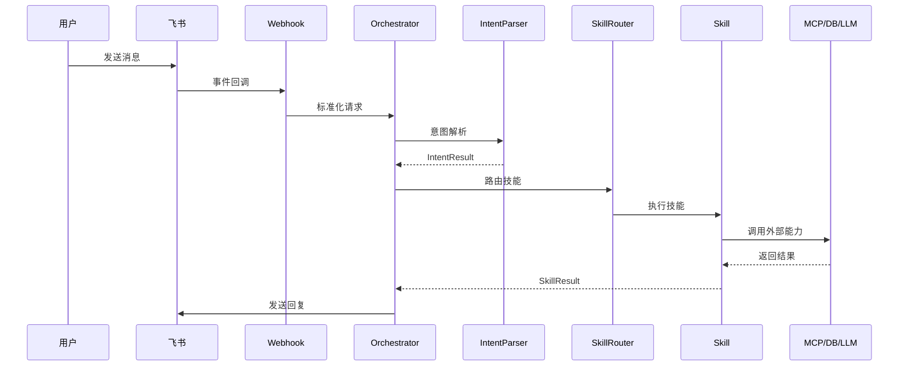

# 飞书 agent 模块介绍

## 1. 模块定位

飞书 agent 是面向飞书私聊场景的案件助手服务，负责接收飞书事件回调、识别意图、调用业务技能，并返回可读结果。整体架构以“意图解析 + 技能路由 + 执行结果格式化”为核心，同时支持提醒调度、记忆管理与监控指标上报。

## 2. 主要能力

- 飞书消息回调处理（私聊为主）
- 案件/文档查询（通过 MCP 服务调用）
- 查询结果摘要汇总
- 提醒创建、列表、完成、删除、定时推送
- 会话上下文与用户记忆管理（含可选向量检索）
- Prometheus 指标输出
- 配置热更新（skills/prompts）
- 本地技能市场动态加载

## 3. 架构图

## 4. 数据流图

## 5. 核心模块概览

### 5.1 入口与路由

- `src/main.py`
  - FastAPI 入口
  - 注册 `/health`、`/metrics`、`/feishu/webhook`
  - 启动热更新与提醒调度器

- `src/api/webhook.py`
  - 飞书事件回调入口
  - 验证/解密/去重/过滤
  - 交给编排器处理并发送回复

### 5.2 编排与意图

- `src/core/orchestrator.py`
  - 统一编排：意图解析 → 技能路由 → 执行
  - 管理上下文、记忆、事件记录
  - 可注入向量检索结果

- `src/core/intent/parser.py`
  - 规则优先 + LLM 兜底
  - 支持链式技能意图

- `src/core/intent/rules.py`
  - 日期类查询规则（强制走 QuerySkill）

### 5.3 技能系统

- `src/core/router/router.py`
  - 技能路由与链式执行
  - 技能名标准化映射（chitchat/query 等）

- `src/core/skills/query.py`
  - 案件/文档查询
  - 调用 MCP 工具 `feishu.v1.bitable.search` / `feishu.v1.doc.search`

- `src/core/skills/summary.py`
  - 对上一次查询结果生成摘要

- `src/core/skills/reminder.py`
  - 提醒 CRUD 与时间解析
  - 支持“1分钟后/1小时后”语义

- `src/core/skills/chitchat.py`
  - 问候/帮助/敏感拒答/闲聊

### 5.4 提醒调度与数据库

- `src/jobs/reminder_scheduler.py`
  - APScheduler 定时扫描到期提醒并推送

- `src/db/postgres.py`
  - Reminder 表 CRUD
  - Advisory Lock 防止多实例重复推送

### 5.5 记忆与向量检索

- `src/core/memory/manager.py`
  - 用户记忆、日志记录、上下文快照
  - 可选向量写入/检索

- `src/vector/*`
  - Chroma 存储与 SiliconFlow embedding（可选启用）

### 5.6 监控与工具

- `src/utils/metrics.py`
  - Prometheus 指标定义与采集

- `src/api/metrics.py`
  - `/metrics` 输出

- `src/utils/feishu_api.py`
  - 飞书消息发送与 token 管理

## 6. 配置文件说明

- `config/skills.yaml`
  - 技能关键词、链式触发、提醒参数、技能市场配置

- `config/prompts.yaml`
  - LLM 提示词配置

- `config/vector.yaml`
  - 向量记忆配置（可选启用）

## 7. 运行与接口

- 健康检查：`GET /health`
- 指标：`GET /metrics`
- 飞书回调：`POST /feishu/webhook`

## 8. 依赖与外部服务

- MCP Feishu Server（提供案件/文档检索工具）
- PostgreSQL（提醒功能持久化）
- 可选：Chroma + SiliconFlow embedding

## 9. 常见问题提示

- 本地测试若使用模拟 webhook，`user_id` 可能不是 open_id，会导致提醒推送 400
- 飞书事件订阅回调必须公网可达（如使用 ngrok/Cloudflare Tunnel）
- Summary 依赖上一次查询结果，空结果会导致汇总失败
