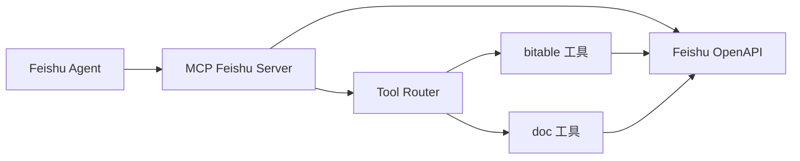
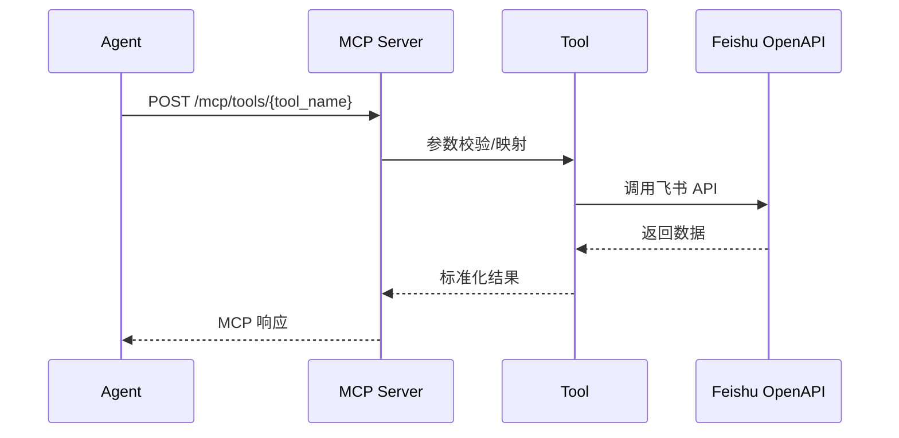

# MCP Feishu Server

飞书 MCP 工具层服务，负责封装多维表格与文档检索能力，为上层 Agent 提供统一的 MCP 工具接口。

统一流程（部署前/备案中/上线后）见：`../../docs/deploy/three-stage-guide.md`

---

## 📋 功能概览

- ✅ 飞书 Tenant Token 自动获取与刷新
- ✅ 多维表格检索（关键词、精确匹配、日期范围、人员字段）
- ✅ 多维表格单条记录获取
- ✅ 多维表格记录创建、更新、删除
- ✅ 飞书文档搜索
- ✅ MCP 工具注册与统一调用入口
- ✅ ROLE 进程隔离（`mcp_server` / `automation_worker`）
- ✅ 自动化通知 Webhook（可选：对接调度器/外部系统回调）

## 🗂️ 目录说明

- `src/`：服务源码（ROLE 应用装配、路由、自动化引擎、工具实现）
- `tests/`：本地测试代码（默认不入库）
- `scripts/`：运维与修复脚本
- `docs/`：服务级文档
- `automation_spec/`：文档与模板（不参与运行时加载）
- `automation_rules.yaml`：运行时规则（实际生效）
- `automation_data/`：运行时产物（快照/日志/死信，默认已忽略）

详见：`docs/PROJECT_STRUCTURE.md`

---

## 🏗️ 架构图



## 📊 数据流图



---

## 🚀 快速开始

说明：`run_dev.py（根目录权威实现）`，本目录 `run_dev.py` 仅作为代理入口。

### 1. 安装依赖

```bash
# 全仓开发（推荐，在仓库根目录执行）
# pip install -r requirements.txt

# 仅 MCP 单服务依赖（在当前目录执行）
pip install -r requirements.txt
```

### 2. 准备配置

```bash
cp config.yaml.example config.yaml
cp .env.example .env
```

### 3. 配置环境变量

```env
# 运行角色（容器部署时由 service 覆盖）
ROLE=mcp_server
MCP_PORT=8081

# 飞书应用凭证
FEISHU_DATA_APP_ID=cli_xxx
FEISHU_DATA_APP_SECRET=xxx

# 多维表格配置
BITABLE_DOMAIN=xxx           # 企业域名，如 xxx.feishu.cn 中的 xxx
BITABLE_APP_TOKEN=xxx        # 表格 App Token
BITABLE_TABLE_ID=xxx         # 默认表格 ID
BITABLE_VIEW_ID=             # 视图 ID（可选，建议留空）

  # 自动化关键开关（可选）
  AUTOMATION_ENABLED=true
  AUTOMATION_SQLITE_DB_FILE=automation_data/automation.db
  AUTOMATION_POLLER_ENABLED=false
  AUTOMATION_STATUS_WRITE_ENABLED=false
  FEISHU_EVENT_VERIFY_TOKEN=your_event_token
AUTOMATION_TRIGGER_ON_NEW_RECORD_EVENT=true
AUTOMATION_TRIGGER_ON_NEW_RECORD_SCAN=true
AUTOMATION_TRIGGER_ON_NEW_RECORD_SCAN_REQUIRES_CHECKPOINT=true
AUTOMATION_SCHEMA_SYNC_ENABLED=true
AUTOMATION_SCHEMA_POLLER_ENABLED=false
AUTOMATION_SCHEMA_SYNC_INTERVAL_SECONDS=300
AUTOMATION_SCHEMA_SYNC_EVENT_DRIVEN=true
AUTOMATION_SCHEMA_WEBHOOK_ENABLED=true
AUTOMATION_SCHEMA_WEBHOOK_URL=https://open.feishu.cn/open-apis/bot/v2/hook/xxx
AUTOMATION_SCHEMA_WEBHOOK_SECRET=xxx
  AUTOMATION_SCHEMA_WEBHOOK_DRILL_ENABLED=false

  # 自动化通知回调（可选：用于把自动化运行信息推送到外部系统）
  AUTOMATION_NOTIFY_WEBHOOK_URL=https://notify.example.com/webhook
  AUTOMATION_NOTIFY_API_KEY=your_key
  AUTOMATION_NOTIFY_TIMEOUT_SECONDS=5
```

双组织说明：
- MCP Server 仅使用组织A数据凭证（`FEISHU_DATA_*`）
- 若要走实时自动化，需要在组织A应用里配置事件订阅回调 `/feishu/events`

### 4. 启动服务

```bash
# 统一开发入口（推荐，当前目录代理）
python run_dev.py up

# 一键拉起全部（含 monitoring + db）
python run_dev.py up --all

# 冲突清理（容器名/历史残留）
python run_dev.py clean

# 手动刷新 schema（省 API 调试）
python run_dev.py refresh-schema
python run_dev.py refresh-schema --table-id tbl_xxx --app-token app_xxx

# 鉴权健康检查（排查 token/网络）
python run_dev.py auth-health

# 手动补偿扫描（验证新增记录是否触发同步）
python run_dev.py sync
python run_dev.py scan --table-id tbl_xxx --app-token app_xxx

# 说明：sync 会做新增+修改同步，并对 upsert 目标表执行删除对账

# 本地未备案阶段建议关闭事件触发，改用 sync/scan 手动补偿
# AUTOMATION_TRIGGER_ON_NEW_RECORD_EVENT=false
# AUTOMATION_POLLER_ENABLED=false
# AUTOMATION_SCHEMA_SYNC_EVENT_DRIVEN=false

# MCP 工具服务（只暴露 /mcp/tools）
ROLE=mcp_server MCP_PORT=8081 python run_server.py

# 自动化 Worker（只暴露 /feishu/events + /automation/*）
ROLE=automation_worker MCP_PORT=8082 python run_server.py
```

默认端口：
- MCP 工具服务：`8081`
- Automation Worker：`8082`

### 5. 实时事件订阅（推荐）

1) 准备公网回调地址（例如 `ngrok http 8082`）

2) 在飞书开发者后台配置事件订阅：
- 请求地址：`https://<你的公网域名>/feishu/events`
- Verification Token：与 `FEISHU_EVENT_VERIFY_TOKEN` 保持一致
- 订阅事件：`drive.file.bitable_record_changed_v1`
- 订阅事件：`drive.file.bitable_field_changed_v1`

3) 建议开关：
- `AUTOMATION_ENABLED=true`
- `AUTOMATION_POLLER_ENABLED=false`（避免轮询抢跑与额外 API 消耗）
- `AUTOMATION_TRIGGER_ON_NEW_RECORD_EVENT=true`

4) 完成后看日志：
- 收到事件：`automation event received`
- 处理结果：`automation event processed`

---

## 🔧 MCP 工具列表

| 工具名 | 功能 | 状态 |
|--------|------|------|
| `feishu.v1.bitable.list_tables` | 列出多维表格表列表 | ✅ |
| `feishu.v1.bitable.search` | 通用搜索（keyword/date） | ✅ |
| `feishu.v1.bitable.search_exact` | 精确字段匹配 | ✅ |
| `feishu.v1.bitable.search_keyword` | 关键词搜索 | ✅ |
| `feishu.v1.bitable.search_person` | 人员字段搜索（open_id） | ✅ |
| `feishu.v1.bitable.search_date_range` | 日期范围搜索 | ✅ |
| `feishu.v1.bitable.record.get` | 获取单条记录 | ✅ |
| `feishu.v1.bitable.record.create` | 创建新记录 | ✅ |
| `feishu.v1.bitable.record.update` | 更新已有记录 | ✅ |
| `feishu.v1.bitable.record.delete` | 删除记录 | ✅ |
| `feishu.v1.doc.search` | 文档搜索 | ✅ |

---

## 📡 API 接口

| 接口 | 方法 | 说明 |
|------|------|------|
| `/health` | GET | 健康检查（两种 role 都可用） |
| `/mcp/tools` | GET | 列出所有工具（`mcp_server:8081`） |
| `/mcp/tools/{tool_name}` | POST | 调用指定工具（`mcp_server:8081`） |
| `/bitable/fields` | GET | 查看表格字段（`mcp_server:8081`） |
| `/feishu/events` | POST | 飞书事件订阅回调（`automation_worker:8082`） |
| `/automation/init` | POST | 初始化快照（`automation_worker:8082`） |
| `/automation/scan` | POST | 手动补偿扫描（`automation_worker:8082`） |
| `/automation/sync` | POST | 手动全量同步（`automation_worker:8082`） |
| `/automation/schema/refresh` | POST | 手动刷新表结构（`automation_worker:8082`） |
| `/automation/auth/health` | GET | 鉴权健康检查（`automation_worker:8082`） |

### 示例请求

```bash
# 健康检查
curl http://localhost:8081/health

# 工具列表
curl http://localhost:8081/mcp/tools

# 表格字段
curl http://localhost:8081/bitable/fields

# 关键词搜索
curl -X POST http://localhost:8081/mcp/tools/feishu.v1.bitable.search_keyword \
  -H "Content-Type: application/json" \
  -d '{"params": {"keyword": "张三"}}'

# 人员字段搜索
curl -X POST http://localhost:8081/mcp/tools/feishu.v1.bitable.search_person \
  -H "Content-Type: application/json" \
  -d '{"params": {"field": "主办律师", "open_id": "ou_xxx"}}'

# 手动刷新全部表 schema
curl -X POST http://localhost:8082/automation/schema/refresh

# 手动全量同步（新增+修改+删除对账）
curl -X POST http://localhost:8082/automation/sync

# 鉴权健康检查（token + 网络）
curl http://localhost:8082/automation/auth/health

# 手动刷新单表 schema
curl -X POST "http://localhost:8082/automation/schema/refresh?table_id=tbl_xxx&app_token=app_xxx"

# 强制风险演练（只发 webhook，不改 schema；需开启 AUTOMATION_SCHEMA_WEBHOOK_DRILL_ENABLED=true）
curl -X POST "http://localhost:8082/automation/schema/refresh?table_id=tbl_xxx&app_token=app_xxx&drill=true"
```

说明：
- 首次刷新（尚无 schema 缓存）会返回 `bootstrap=true`，用于建立基线，不视为风险变更
- 当返回 `changed=false` 时表示本次字段结构无差异，不会产生 `schema_changed/schema_policy_applied` 风险日志
- 为便于排查，系统会记录 `schema_refresh_noop` 运行日志

### Schema 风险演练开关

- `AUTOMATION_SCHEMA_WEBHOOK_DRILL_ENABLED=false`（默认）时，`drill=true` 会被拒绝（HTTP 400）
- `AUTOMATION_SCHEMA_WEBHOOK_DRILL_ENABLED=true` 时，可通过 `/automation/schema/refresh?...&drill=true` 强制发送一条风险告警 webhook
- `drill=true` 必须携带 `table_id`（避免一次刷新对全部表批量推送演练告警）
- 演练仅验证通知链路，不会修改表结构缓存，也不会禁用任何规则

---

## 📁 核心模块

### 入口与路由

- **`src/main.py`** - FastAPI 入口（按 `ROLE` 组装 app）
- **`src/server/app_factory.py`** - role 应用装配（mcp_server / automation_worker）
- **`src/server/mcp.py`** - MCP 工具列表与执行入口

### 自动化编排（Step 3 拆分）

- **`src/automation/service.py`** - 对外 facade 与依赖装配
- **`src/automation/dispatcher.py`** - 事件分发、Webhook 鉴权与规则触发入口
- **`src/automation/processor.py`** - 快照/扫描/同步/Schema 刷新处理链路
- **`src/automation/executor.py`** - Delay/Cron 任务管理与基础校验
- **`src/automation/models.py`** - 共享常量、错误类型与归一化工具

### 工具实现

- **`src/tools/bitable.py`**
  - `BitableListTablesTool` - 表格列表
  - `BitableSearchTool` - 通用搜索
  - `BitableSearchExactTool` - 精确匹配
  - `BitableSearchKeywordTool` - 关键词搜索
  - `BitableSearchPersonTool` - 人员字段搜索
  - `BitableSearchDateRangeTool` - 日期范围搜索
  - `BitableRecordGetTool` - 单条记录读取
  - `BitableRecordCreateTool` - 创建新记录
  - `BitableRecordUpdateTool` - 更新记录
  - `BitableRecordDeleteTool` - 删除记录

- **`src/tools/doc.py`** - 飞书文档搜索

### 服务与配置

- **`src/config.py`** - 环境变量与配置加载
- **`config.yaml`** - 多维表格字段映射、搜索范围、超时等

---

## ⚙️ 配置文件说明

### config.yaml

```yaml
bitable:
  # 企业飞书域名
  domain: ${BITABLE_DOMAIN}
  
  # 默认表格配置
  default_app_token: ${BITABLE_APP_TOKEN}
  default_table_id: ${BITABLE_TABLE_ID}
  default_view_id: ${BITABLE_VIEW_ID:-}
  
  # 字段映射
  field_mapping:
    case_number: "案号"
    client: "委托人及联系方式"
    lawyer: "主办律师"
    hearing_date: "开庭日"
    # ...

  # 搜索配置
  search:
    searchable_fields:
      - "案号"
      - "委托人及联系方式"
      - "主办律师"
    max_records: 100
    default_limit: 20

tools:
  enabled:
    - "feishu.v1.bitable.list_tables"
    - "feishu.v1.bitable.search"
    - "feishu.v1.bitable.search_keyword"
    - "feishu.v1.bitable.search_person"
    # ...
```

---

## 🐛 常见问题

| 问题 | 原因 | 解决方案 |
|------|------|----------|
| 403 Forbidden | 应用权限不足 | 配置 `bitable:app` 权限 |
| WrongViewId | View ID 无效 | 清空 `BITABLE_VIEW_ID` |
| InvalidFilter | 人员字段不支持文本搜索 | 使用 `search_person` 工具 |
| FieldNameNotFound | 字段名不存在 | 检查 `field_mapping` |

---

## 🔎 灰度检查脚本

自动化灰度结束后，可用脚本一次性汇总：

- 运行日志窗口统计（优先读取 `automation_data/automation.db`）
- 死信总量与最近窗口死信数
- 最近窗口状态字段分布（`自动化_执行状态`）
- 最近窗口错误字段非空数量（`自动化_最近错误`）

说明：如果你已删除状态字段，请保持 `AUTOMATION_STATUS_WRITE_ENABLED=false`，通过 `automation.db` 观察 `run_logs/dead_letters`（脚本会在无 SQLite 数据时回退读取旧 JSONL）。

```bash
# 默认检查最近 24 小时
python scripts/automation_gray_check.py

# 严格模式：发现异常返回非 0
python scripts/automation_gray_check.py --strict

# JSON 输出，便于 CI 收集
python scripts/automation_gray_check.py --json

# 零 API 模式（只读本地日志，优先 SQLite）
python scripts/automation_gray_check.py --no-api --strict

# 指定 SQLite 文件
python scripts/automation_gray_check.py --sqlite-db-file automation_data/automation.db
```

---

## 📄 License

MIT License
