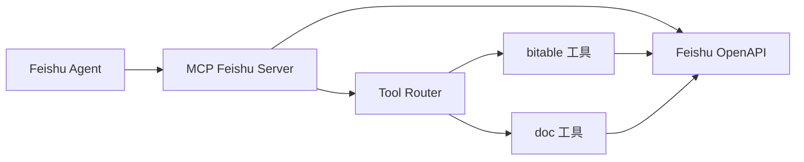
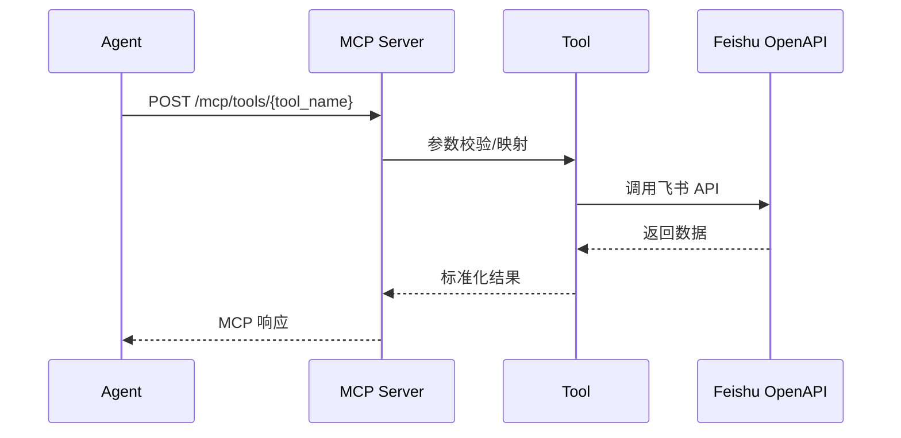

# MCP Feishu Server

飞书 MCP 工具层服务，负责封装多维表格与文档检索能力，为上层 Agent 提供统一的 MCP 工具接口。

---

## 📋 功能概览

- ✅ 飞书 Tenant Token 自动获取与刷新
- ✅ 多维表格检索（关键词、精确匹配、日期范围、人员字段）
- ✅ 多维表格单条记录获取
- ✅ 多维表格记录创建、更新、删除
- ✅ 飞书文档搜索
- ✅ MCP 工具注册与统一调用入口

## 🗂️ 目录说明

- `src/`：服务源码（路由、自动化引擎、工具实现）
- `tests/`：测试代码
- `automation_spec/`：文档与模板（不参与运行时加载）
- `automation_rules.yaml`：运行时规则（实际生效）
- `automation_data/`：运行时产物（快照/日志/死信，默认已忽略）

详见：`PROJECT_STRUCTURE.md`

---

## 🏗️ 架构图



## 📊 数据流图



---

## 🚀 快速开始

### 1. 安装依赖

```bash
pip install -r requirements.txt
```

### 2. 准备配置

```bash
cp config.yaml.example config.yaml
cp .env.example .env
```

### 3. 配置环境变量

```env
# 飞书应用凭证
FEISHU_DATA_APP_ID=cli_xxx
FEISHU_DATA_APP_SECRET=xxx

# 多维表格配置
BITABLE_DOMAIN=xxx           # 企业域名，如 xxx.feishu.cn 中的 xxx
BITABLE_APP_TOKEN=xxx        # 表格 App Token
BITABLE_TABLE_ID=xxx         # 默认表格 ID
BITABLE_VIEW_ID=             # 视图 ID（可选，建议留空）
```

双组织说明：
- MCP Server 仅使用组织A数据凭证（`FEISHU_DATA_*`）
- 组织A应用不需要配置机器人能力、事件订阅或 Webhook 回调

### 4. 启动服务

```bash
# 生产模式
python run_server.py

# 开发模式（热重载）
python run_dev.py
```

默认端口：`8081`

---

## 🔧 MCP 工具列表

| 工具名 | 功能 | 状态 |
|--------|------|------|
| `feishu.v1.bitable.list_tables` | 列出多维表格表列表 | ✅ |
| `feishu.v1.bitable.search` | 通用搜索（keyword/date） | ✅ |
| `feishu.v1.bitable.search_exact` | 精确字段匹配 | ✅ |
| `feishu.v1.bitable.search_keyword` | 关键词搜索 | ✅ |
| `feishu.v1.bitable.search_person` | 人员字段搜索（open_id） | ✅ |
| `feishu.v1.bitable.search_date_range` | 日期范围搜索 | ✅ |
| `feishu.v1.bitable.record.get` | 获取单条记录 | ✅ |
| `feishu.v1.bitable.record.create` | 创建新记录 | ✅ |
| `feishu.v1.bitable.record.update` | 更新已有记录 | ✅ |
| `feishu.v1.bitable.record.delete` | 删除记录 | ✅ |
| `feishu.v1.doc.search` | 文档搜索 | ✅ |

---

## 📡 API 接口

| 接口 | 方法 | 说明 |
|------|------|------|
| `/health` | GET | 健康检查 |
| `/mcp/tools` | GET | 列出所有工具 |
| `/mcp/tools/{tool_name}` | POST | 调用指定工具 |
| `/bitable/fields` | GET | 查看表格字段（调试用）|

### 示例请求

```bash
# 健康检查
curl http://localhost:8081/health

# 工具列表
curl http://localhost:8081/mcp/tools

# 表格字段
curl http://localhost:8081/bitable/fields

# 关键词搜索
curl -X POST http://localhost:8081/mcp/tools/feishu.v1.bitable.search_keyword \
  -H "Content-Type: application/json" \
  -d '{"params": {"keyword": "张三"}}'

# 人员字段搜索
curl -X POST http://localhost:8081/mcp/tools/feishu.v1.bitable.search_person \
  -H "Content-Type: application/json" \
  -d '{"params": {"field": "主办律师", "open_id": "ou_xxx"}}'
```

---

## 📁 核心模块

### 入口与路由

- **`src/main.py`** - FastAPI 入口，注册 `/health` 与 MCP 工具路由
- **`src/server/http.py`** - MCP 工具列表与执行入口

### 工具实现

- **`src/tools/bitable.py`**
  - `BitableListTablesTool` - 表格列表
  - `BitableSearchTool` - 通用搜索
  - `BitableSearchExactTool` - 精确匹配
  - `BitableSearchKeywordTool` - 关键词搜索
  - `BitableSearchPersonTool` - 人员字段搜索
  - `BitableSearchDateRangeTool` - 日期范围搜索
  - `BitableRecordGetTool` - 单条记录读取
  - `BitableRecordCreateTool` - 创建新记录
  - `BitableRecordUpdateTool` - 更新记录
  - `BitableRecordDeleteTool` - 删除记录

- **`src/tools/doc.py`** - 飞书文档搜索

### 服务与配置

- **`src/config.py`** - 环境变量与配置加载
- **`config.yaml`** - 多维表格字段映射、搜索范围、超时等

---

## ⚙️ 配置文件说明

### config.yaml

```yaml
bitable:
  # 企业飞书域名
  domain: ${BITABLE_DOMAIN}
  
  # 默认表格配置
  default_app_token: ${BITABLE_APP_TOKEN}
  default_table_id: ${BITABLE_TABLE_ID}
  default_view_id: ${BITABLE_VIEW_ID:-}
  
  # 字段映射
  field_mapping:
    case_number: "案号"
    client: "委托人及联系方式"
    lawyer: "主办律师"
    hearing_date: "开庭日"
    # ...

  # 搜索配置
  search:
    searchable_fields:
      - "案号"
      - "委托人及联系方式"
      - "主办律师"
    max_records: 100
    default_limit: 20

tools:
  enabled:
    - "feishu.v1.bitable.list_tables"
    - "feishu.v1.bitable.search"
    - "feishu.v1.bitable.search_keyword"
    - "feishu.v1.bitable.search_person"
    # ...
```

---

## 🐛 常见问题

| 问题 | 原因 | 解决方案 |
|------|------|----------|
| 403 Forbidden | 应用权限不足 | 配置 `bitable:app` 权限 |
| WrongViewId | View ID 无效 | 清空 `BITABLE_VIEW_ID` |
| InvalidFilter | 人员字段不支持文本搜索 | 使用 `search_person` 工具 |
| FieldNameNotFound | 字段名不存在 | 检查 `field_mapping` |

---

## 🔎 灰度检查脚本

自动化灰度结束后，可用脚本一次性汇总：

- 运行日志窗口统计（`automation_data/run_logs.jsonl`）
- 死信总量与最近窗口死信数
- 最近窗口状态字段分布（`自动化_执行状态`）
- 最近窗口错误字段非空数量（`自动化_最近错误`）

说明：如果你已删除状态字段，请保持 `AUTOMATION_STATUS_WRITE_ENABLED=false`，仅依赖 `run_logs.jsonl` 与 `dead_letters.jsonl` 观察。

```bash
# 默认检查最近 24 小时
python automation_gray_check.py

# 严格模式：发现异常返回非 0
python automation_gray_check.py --strict

# JSON 输出，便于 CI 收集
python automation_gray_check.py --json

# 零 API 模式（只读本地 run_logs/dead_letters）
python automation_gray_check.py --no-api --strict
```

---

## 📄 License

MIT License
