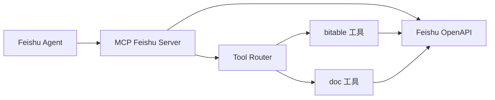
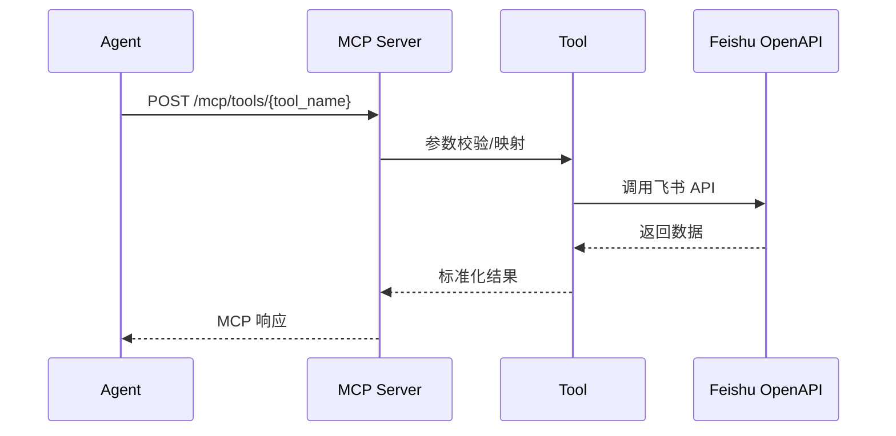

# 飞书 MCP 模块介绍

## 1. 模块定位

MCP Feishu Server 是飞书工具层服务，负责封装多维表格与文档检索能力，为上层 Agent 提供统一的 MCP 工具接口。它处理飞书租户 Token 获取、API 调用、字段映射与结果格式化。

## 2. 主要能力

- 飞书 Tenant Token 自动获取与刷新
- 多维表格检索（案件数据）
- 多维表格单条记录获取
- **多维表格记录创建**（新增）
- **多维表格记录更新**（新增）
- 飞书文档搜索
- MCP 工具注册与统一调用入口

## 3. 架构图

## 4. 数据流图

## 5. 核心模块概览

### 5.1 入口与路由

- `src/main.py`
  - FastAPI 入口
  - 注册 `/health` 与 MCP 工具路由

- `src/server/http.py`
  - MCP 工具列表与执行入口
  - `/bitable/fields` 字段查看接口（调试用）

### 5.2 工具实现

- `src/tools/bitable.py`
  - `BitableSearchTool` - 多维表格检索
  - `BitableRecordGetTool` - 单条记录读取
  - `BitableRecordCreateTool` - 创建新记录（新增）
  - `BitableRecordUpdateTool` - 更新记录（新增）

- `src/tools/doc.py`
  - 飞书文档搜索

### 5.3 服务与配置

- `src/config.py`
  - 环境变量与配置加载
- `config.yaml`
  - 多维表格字段映射、搜索范围、超时等

## 6. MCP 工具列表

| 工具名 | 功能 | 状态 |
|--------|------|------|
| `feishu.v1.bitable.search` | 多维表格查询（keyword/date_from/date_to） | ✅ |
| `feishu.v1.bitable.record.get` | 获取单条多维表格记录 | ✅ |
| `feishu.v1.bitable.record.create` | 创建新记录 | ✅ 新增 |
| `feishu.v1.bitable.record.update` | 更新已有记录 | ✅ 新增 |
| `feishu.v1.doc.search` | 文档搜索 | ✅ |

## 7. 对外接口

| 接口 | 方法 | 说明 |
|------|------|------|
| `/health` | GET | 健康检查 |
| `/mcp/tools` | GET | 列出所有工具 |
| `/mcp/tools/{tool_name}` | POST | 调用指定工具 |
| `/bitable/fields` | GET | 查看表格字段（调试）|

## 8. 关键配置项

- `FEISHU_APP_ID` / `FEISHU_APP_SECRET`
- `BITABLE_APP_TOKEN` / `BITABLE_TABLE_ID`
- `BITABLE_VIEW_ID`（可选）
- `BITABLE_DOMAIN`（可选）

## 9. 常见问题提示

- 多维表格字段名称变化会导致查询失败，需同步更新 `field_mapping`
- 表权限或 Token 无效会导致 400/401/403
- 本地测试使用 `python run_dev.py` 支持热重载
- 使用 `/bitable/fields` 接口可以实时查看表格字段
